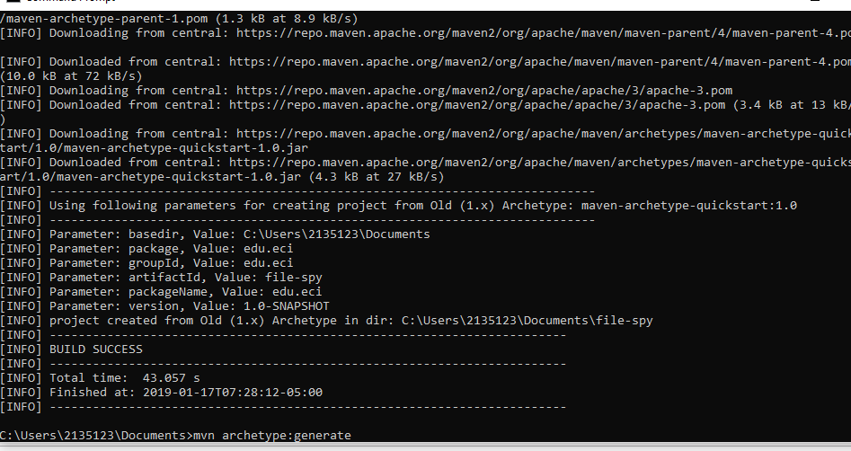
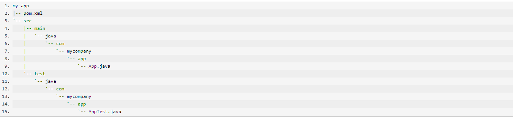
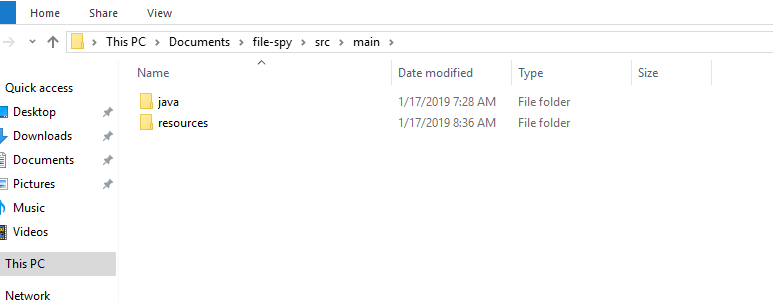
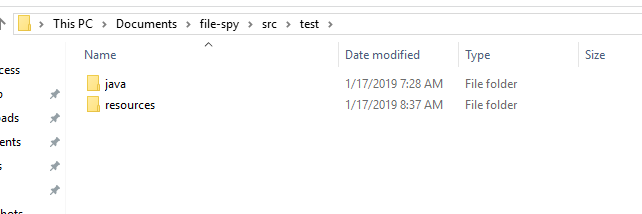
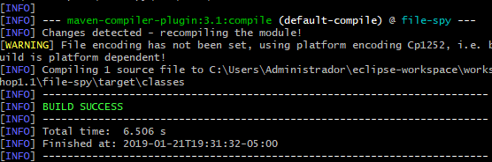
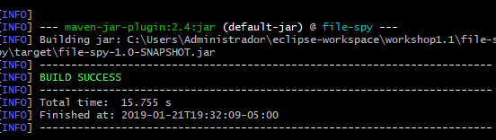
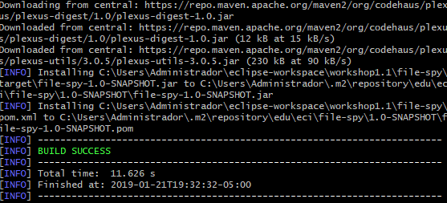
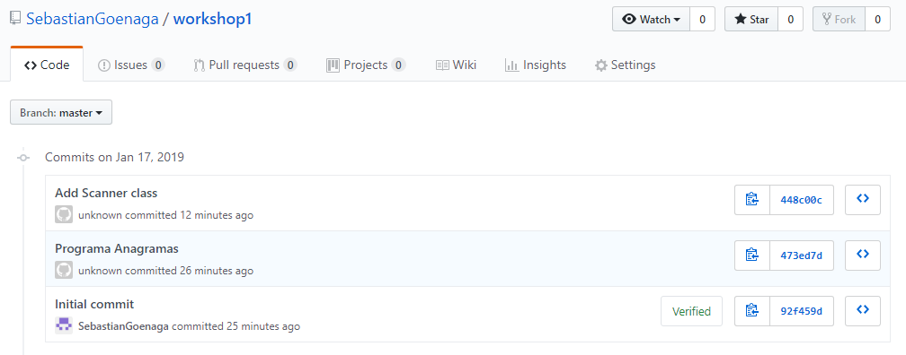

# Lab1 ARSW

## Maven Basic Concepts

Resultado del comando:

mvn archetype:generate -B -DgroupId=edu.eci -DartifactId=file-spy



Because we do not specify the archetype, maven takes by default quickstart 1.0

#### EXPLANING PARAMETERS VALUES:

Basedir: Site in the project resides.

Package: Project to which the package command is applied, the groupID.

GroupID: Identify the project, that’s why it has naming schema.

artifactID: Is the name of the jar.

Version: SNAPSHOT means our project is under development.

The option -B, in the command disable output color.

The option -D, define system properties. In this case we specify artifactID and groupID.

#### The content of directory have the next structure:



In this case, “com” folder is “edu” and “app” is “eci” equivalence. That’s define by the groupID.

### Creating resources





### The POM file

#### Packing tag
It says the way maven will package the application (jar, war, etc).
#### The purpose of the dependencies and dependency tags into the POM file
The dependency tags serve to pull libraries that we are going to need, for example, the junit dependency.

#### Dependency Management
I added the tika-core dependency into the tag of dependencies in the pom.xml file.

After that I added the FilesSpy class replacing the App class.

The functionality of this class is spy the files we created in the computer with extension .csv

### Building Lifecycles and Plugins
The default lifecycle handles your project deployment, the clean lifecycle handles project cleaning, while the site lifecycle handles the creation of your project's site documentation.

- compile

With this command we compile all source code.

- package

This take the compiled code and package it to generate the .jar or what ever format we want.
- install

This install the package into local repository and then we can use it like dependency.

Then I created new proyect like the instructions says and going to use file-spy as a dependency for excute it. For do that I had to add the next dependency in the pom.xml

```
<dependency>
	<groupId>edu.eci</groupId>
	<artifactId>file-spy</artifactId>
	<version>1.0-SNAPSHOT</version>
</dependency>
```

## Git Basic Concepts

### What is the purpose of this command? (add)
This command add elements which we are going to commit, we can add some archives or all of them using ".".

### Why we used it? (commit)
Because is a good practice put a message to commit, to know what we do in the future.
And the commit is to send updates.

### What is the purpose of the this command? (push)
To send changes to the remote repository.

### What is the purpose of this command? (clone)
To copy the remote repository to the local one.

### Screenshot


### What that command does? (pull)
To pull the changes and update local repository since origin (remote repository) to master branch


