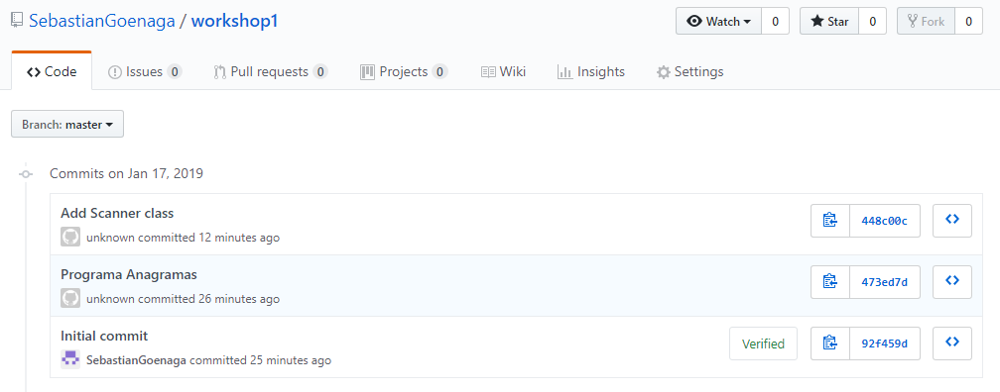

# Lab1 ARSW

Hi! I'm your first Markdown file in **StackEdit**. If you want to learn about StackEdit, you can read me. If you want to play with Markdown, you can edit me. Once you have finished with me, you can create new files by opening the **file explorer** on the left corner of the navigation bar.

### What is the purpose of this command? (add)
This command add elements which we are going to commit, we can add some archives or all of them using ".".

### Why we used it? (commit)
Because is a good practice put a message to commit, to know what we do in the future.
And the commit is to send updates.

### What is the purpose of the this command? (push)
To send changes to the remote repository.

### What is the purpose of this command? (clone)
To copy the remote repository to the local one.

### Screenshot

### What that command does? (pull)
To pull the changes and update local repository since origin (remote repository) to master branch

